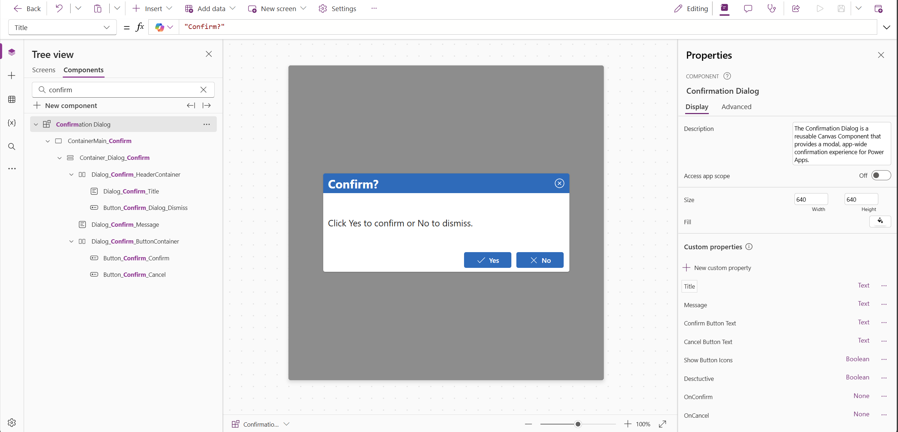
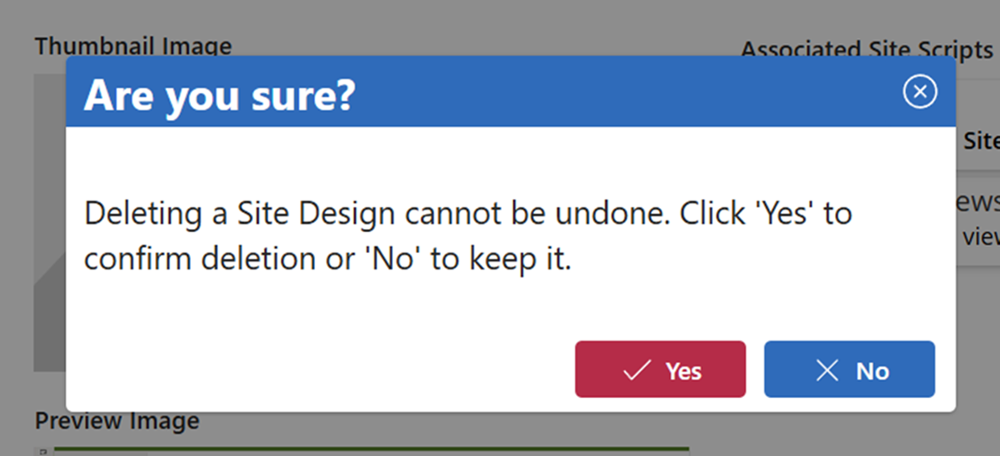

# Confirmation Dialog Component

## Summary

The Confirmation Dialog is a reusable Canvas Component that provides a modal, app-wide confirmation experience for Power Apps. It displays a centered dialog with a customizable title, message, and configurable Confirm and Cancel buttons.

#### Key features:

- Customizable Title, Message, Confirm Button Text, and Cancel Button Text
- Optional destructive mode for high‑risk actions
- Optional button icons
- Modal overlay with built‑in close/dismiss behavior
- Event properties (OnConfirm, OnCancel) for clean app integration

Use this component to standardize confirmation UI patterns throughout your Canvas Apps.

## Applies to

## Compatibility

## Contributors

* [Jim Duncan](https://github.com/sparkitect)

## Version history

Version|Date|Comments
-------|----|--------
1.0|December 30, 2025|Initial release

## Prerequisites

None

## Minimal path to awesome

### Using the source code

1. Open your canvas app in **Power Apps**
2. Copy the contents of the **[YAML file](./source/confirmation-dialog-component.yaml)**
3. Right-click on the **Components** section in the tree view and select **Paste**
4. Navigate to the Screens area and add the component (with the highest z-index)
5. Configure it to your liking with the available properties

## Features

This solution illustrates the following concepts on top of the Power Platform:

* Custom Canvas Components
* Component Input Properties (Data)
* Component Event Properties (Events)
* Modal UI patterns
* Accessibility features

## Component Properties

| Property | Type | Description | Default |
|----------|------|-------------|----------|
| Title | Input (Text) | Title of the dialog | "Confirm?" |
| Message | Input (Text) | Message text of the dialog | "Click Yes to confirm or No to dismiss." |
| ConfirmButtonText | Input (Text) | Text to display on the Confirm button | "Yes" |
| CancelButtonText | Input (Text) | Text to display on the Cancel button | "No" |
| Destructive | Input (Boolean) | True if the action is destructive (Confirm button will be red) | false |
| ShowButtonIcons | Input (Boolean) | True to show icons on the buttons | true |
| OnConfirm | Event | Fired when user clicks Confirm button | - |
| OnCancel | Event | Fired when user clicks Cancel button or closes the dialog | - |

## Help

We do not support snippets, but this community is always willing to help, and we want to improve these snippets. We use GitHub to track issues, which makes it easy for community members to volunteer their time to help you.

If you encounter any issues while using this snippet, you can [create a new issue](https://github.com/pnp/powerplatform-snippets/issues/new?assignees=&labels=Needs%3A+Triage+%3Amag%3A%2Ctype%3Abug-suspected&template=bug-report.yml&title=).

For questions regarding this snippet, [create a new question](https://github.com/pnp/powerplatform-snippets/issues/new?assignees=&labels=Needs%3A+Triage+%3Amag%3A%2Ctype%3Aquestion&template=question.yml&title=).

Finally, if you have an idea for improvement, [make a suggestion](https://github.com/pnp/powerplatform-snippets/issues/new?assignees=&labels=Needs%3A+Triage+%3Amag%3A%2Ctype%3Aenhancement&template=suggestion.yml&title=).

## Disclaimer

**THIS CODE IS PROVIDED *AS IS* WITHOUT WARRANTY OF ANY KIND, EITHER EXPRESS OR IMPLIED, INCLUDING ANY IMPLIED WARRANTIES OF FITNESS FOR A PARTICULAR PURPOSE, MERCHANTABILITY, OR NON-INFRINGEMENT.**

